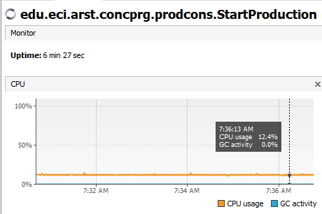
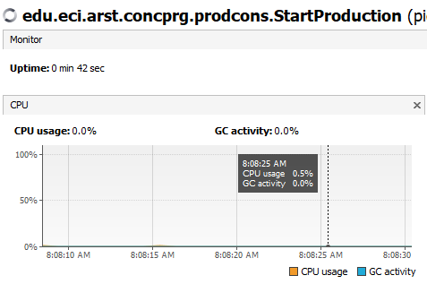
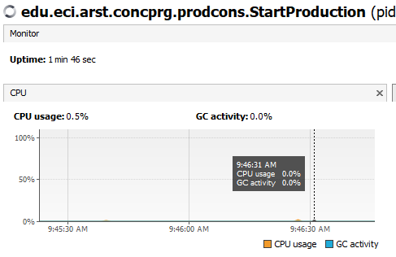
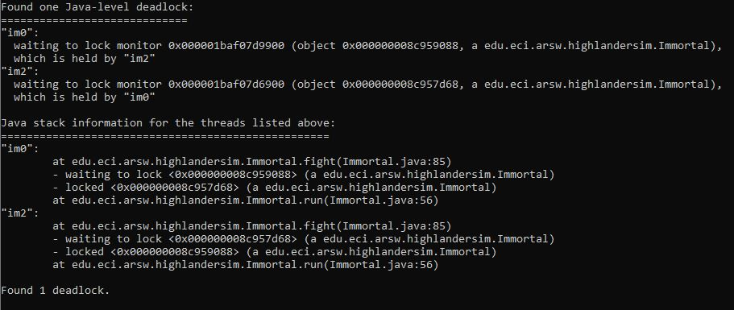

## Compile and run instructions

## Part I

1) La siguiente imagen muestra el uso del CPU al correr el programa.
\
Este uso del CPU es debido a que el hilo de la clase `Consumer`
 pregunta a cada momento si se ha agregado un elemento a la cola de 
 los productos. Estas consultas innecesarias causan mayor uso de la 
 CPU.
 2) La siguiente imagen muestra el uso del CPU al 
 realizarlo más eficiente.
 \
 Se realizó lo siguiente para reducir el consumo de la CPU.
 
    ```java
    public class Consumer extends Thread{
        @Override
        public void run() {
            while (true) {
                synchronized(queue){
                    while (queue.isEmpty()) {
                        try {
                            queue.wait();
                        } catch (InterruptedException ex) {
                            Logger.getLogger(Consumer.class.getName()).log(Level.SEVERE, null, ex);
                        }
                    }
                    int elem=queue.poll();
                    System.out.println("Consumer consumes "+elem);
                }
            }
        }
    }

    ```
    ```java
    public class Producer extends Thread {
        @Override
        public void run() {
            while (true) {
                dataSeed = dataSeed + rand.nextInt(100);
                System.out.println("Producer added " + dataSeed);
                synchronized(queue){
                    queue.add(dataSeed);
                    queue.notifyAll();
                }
                try {
                    Thread.sleep(1000);
                } catch (InterruptedException ex) {
                    Logger.getLogger(Producer.class.getName()).log(Level.SEVERE, null, ex);
                }
            }
        }
    }
    ```
 3) Se verificó el consumo del CPU con un límite pequeño.\
 \
 El productor llena su lista y notifica 
 al consumidor para que este la vacíe.
 
    Clase `Producer`:
    ```java 
    synchronized(queue){
        while(queue.size()==stockLimit){
            queue.notifyAll();
            try {
                queue.wait();
            } catch (InterruptedException ex) {
                Logger.getLogger(Producer.class.getName()).log(Level.SEVERE, null, ex);
            }
        }
        dataSeed = dataSeed + rand.nextInt(100);
        System.out.println("Producer added " + dataSeed);
        queue.add(dataSeed);
    }
    ```
    Clase `Consumer`:
    ```java
    synchronized(queue){
        while (queue.isEmpty()) {
            queue.notifyAll();
            try {
                queue.wait();
            } catch (InterruptedException ex) {
                Logger.getLogger(Consumer.class.getName()).log(Level.SEVERE, null, ex);
            }
        }
        int elem=queue.poll();
        System.out.println("Consumer consumes "+elem);
    }
    ```

## Part II
1.
2. *Review the code and identify how the functionality indicated above was implemented. Given the intention of the game, an invariant
should be that the sum of the life points of all
players is always the same (of course, in an instant
of time in which a time increase / reduction operation is not in
process ). For this case, for N players, what 
should this value be?*
    
    Para N jugadores la invariante sería la siguiente:
     *N* * `DEFAULT_IMMORTAL_HEALTH`
3. *Run the application and verify how the ‘pause and check’ option works. 
Is the invariant fulfilled?*
    
    No, la suma de los puntos de vida de todos los jugadores se ve alterado,
     disminuyen o aumentando de una forma aparentemente aleatoria.
4. *A first hypothesis that the race condition for this function 
(pause and check) is presented is that the program consults the list whose 
values ​​it will print, while other threads modify their values. 
To correct this, do whatever is necessary so that, before printing the current
results, all other threads are paused. Additionally, implement the ‘resume’
option.*

5. *Check the operation again 
(click the button many times). Is the invariant fulfilled or not ?.*

    La invariante aún no se está cumpliendo.

6. *Identify possible critical regions in regards to the fight of the immortals.
Implement a blocking strategy that avoids race conditions. Remember that if you 
need to use two or more ‘locks’ simultaneously, you can use nested synchronized
blocks:*

7. *After implementing your strategy, start running your program, and pay attention to whether it comes to a halt.
If so, use the jps and jstack programs to identify why the program stopped.*

    Se utiliza la herramienta jstack para identificar porque el programa se detuvo.
    
    
    
    El programa se detuvo debido a que ocurrió un deadlock.

8. *Consider a strategy to correct the problem identified above (you can review Chapter 15 of Java Concurrency in Practice again)*

9. 
    